# lol-ps
this is lol.ps clone Project

## このプロジェクトはSpringBootで開発しました。

## lol ps project を紹介します。
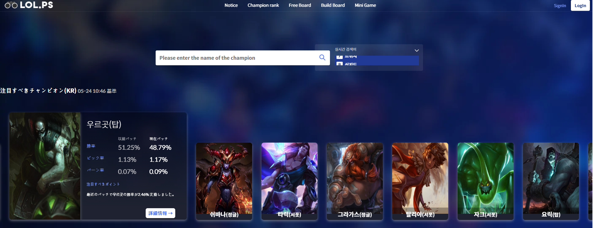
#### メインページです。今回のパッチでもっとも注目すべきチャンピオンをカードで見せます。
#### 選定基準は勝率変動が高いチャンピオンの８人です。
#### カードをクリックするとチャンピオンの最近統計の変動が見えます。

#### 詳細情報をクリックすると

## チャンピオン統計ページに移動します。
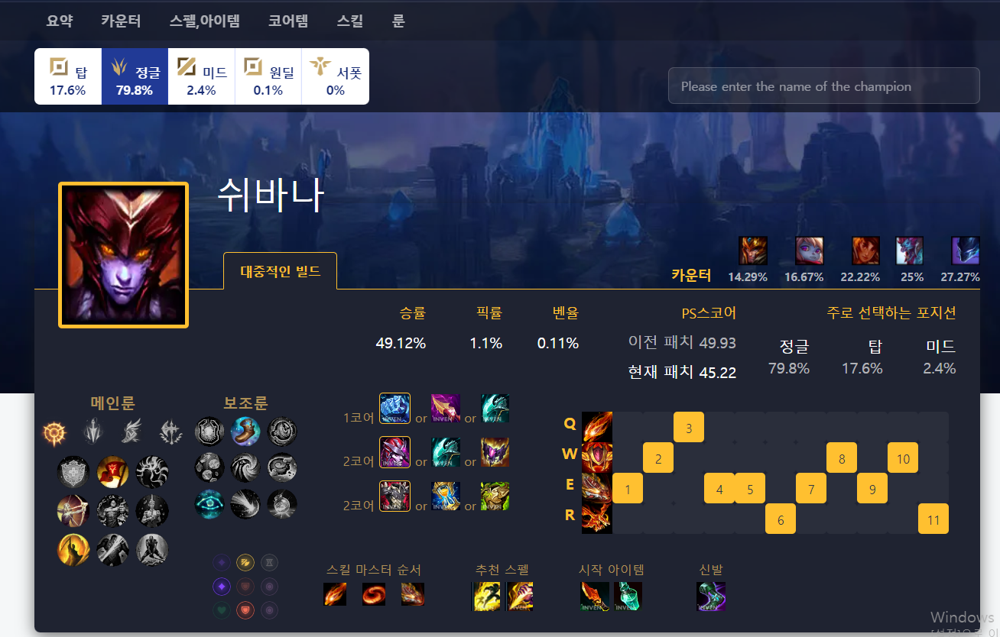

## チャンピオンランクページです。
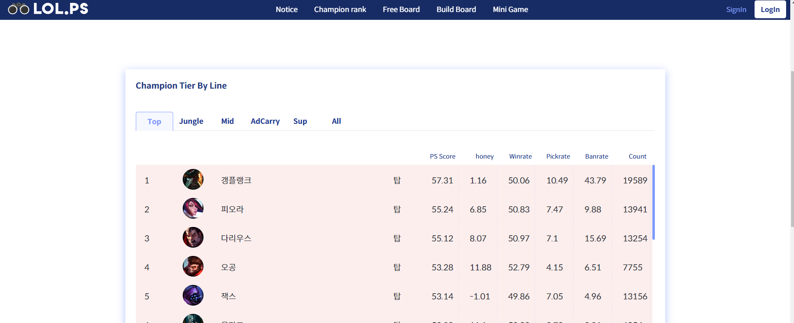
#### ライン別チャンピオンの順位を見ることができます。
#### 詳細を見たいチャンピオンをクリックするとチャンピオン統計ページに移動します。

## 会員登録ページです。
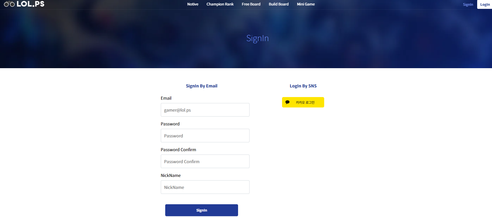

#### email、パスワードの有効性を検査します。

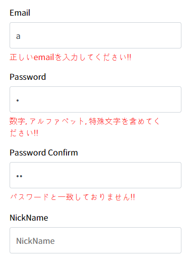

#### emailが重複の場合です。
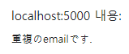

## ログインページです。
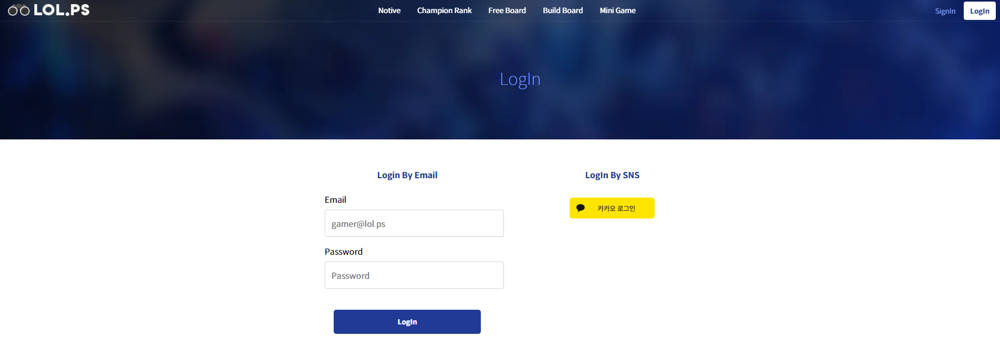

#### 会員登録した情報でログインするか、Kakaoでログインするか選べます。
#### Kakaoログインの場合、Kakao REST APIを利用しました。

## マイページです。
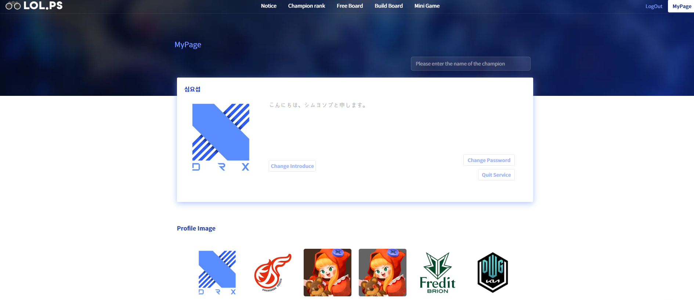
#### 自己紹介、パスワード変更、会員脱退の機能があります。

## 自由掲示板です。
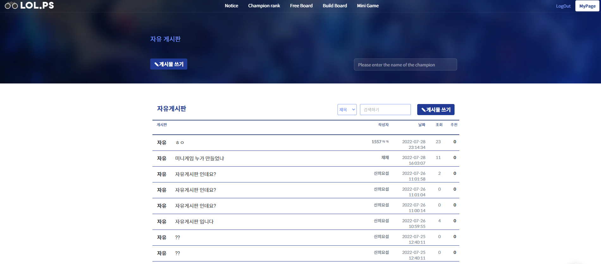
#### ログインした会員のみ、書き込むことができます。
#### ログインしなかった場合、書き込みボタンを押すと、ログインページに移動します。

## 書き込みページです。
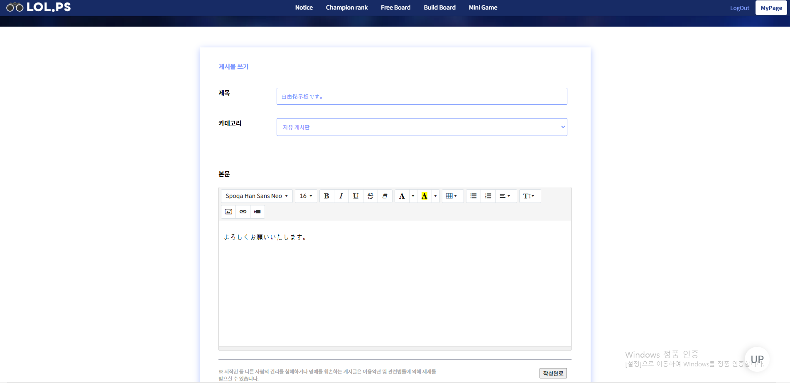

カテゴリーで빌드연구소をクリックした場合

このようにチャンピオンを選択することができます。このチャンピオンについて書く掲示板です。

## ビルド研究所です。

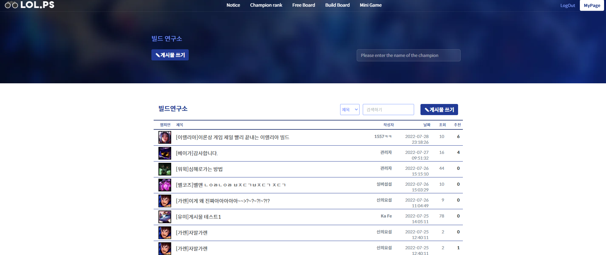
チャンピオンのビルドに関する話をする掲示板です。

## お知らせページです。

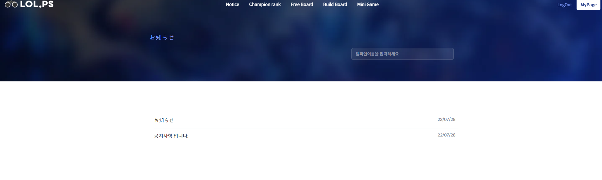
管理者ではない場合、書き込みボタンが見えません。

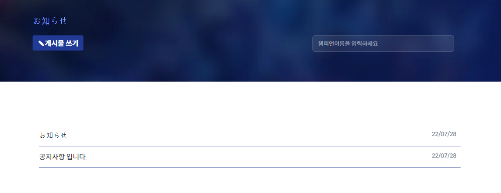
管理者ログインをした場合の画面。

## 管理者の場合、すべての掲示物を削除できる権限が与えられます。
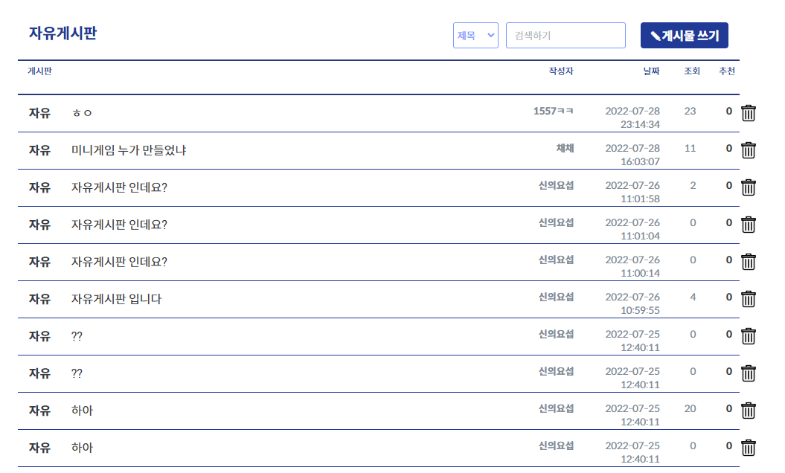
このようにすべての開示物を削除できるゴミ箱があらわれ、クリックすると削除できます。

## チャンピオン検索することができます。
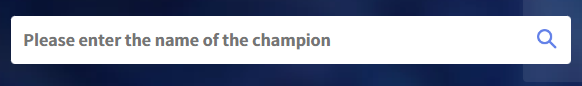
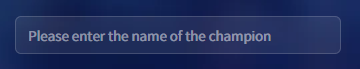

検索すると検索した名前のチャンピオンの統計ページに移動します。

データーが韓国語で韓国語しか支援しない部分申し訳ございません。
